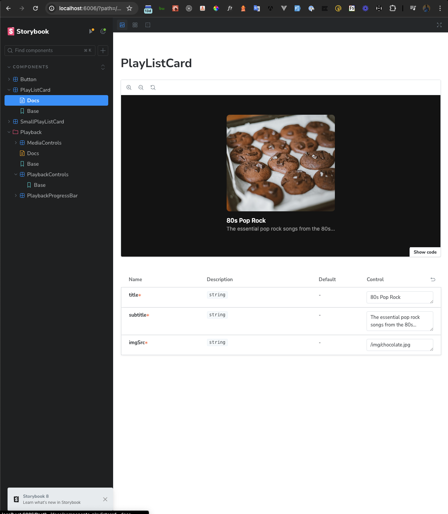

# Spotify UI Clone

A Spotify UI clone built with Next.js 14. This project is currently a work in progress. You can track the development progress and see what tasks are pending on the [Trello board](https://trello.com/b/cK8QejuG/spotify-ui-clone).

## How to Run the Project

### Prerequisites
Make sure you have Node.js and npm installed on your machine.

### Installation
1. Clone the repository:
    ```bash
    git clone https://github.com/your-username/spotify-ui-clone.git
    cd spotify-ui-clone
    ```
2. Install the dependencies:
    ```bash
    npm install
    ```

### Development Server
1. Run the development server:
    ```bash
    npm run dev
    ```
2. Open [http://localhost:3000](http://localhost:3000) in your browser to view the application.

## View Components Documentation via Storybook

Storybook is used for developing and showcasing UI components. To view the component documentation:

1. Run Storybook:
    ```bash
    npm run storybook
    ```
2. You will be automatically redirected to [http://localhost:6000](http://localhost:6000) to view the documentation.

